# Voice Health Agent & Phone Cough Classifier

🎙️ **An AI-powered voice agent for accessible respiratory and mental health screening.**

[](https://www.python.org/downloads/)
[](https://fastapi.tiangolo.com/)
[](https://www.docker.com/)
[](https://opensource.org/licenses/MIT)

This platform transforms a simple phone call into a comprehensive health screening tool. Designed specifically for **rural accessibility**, it allows users to interact with an AI voice agent in their native language to receive preliminary screenings for:

- 🫁 **Respiratory Diseases** (COPD, Asthma, Pneumonia)
- 🧠 **Parkinson's Disease** (voice tremor analysis)
- 💭 **Depression** (acoustic biomarker analysis)

---

## 📋 Table of Contents

- [Key Features](#-key-features)
- [Rural India Accessibility Suite](#-rural-india-accessibility-suite)
- [User Journeys & Workflows](#-user-journeys--workflows)
- [Health Screening Models](#-comprehensive-health-screening-models)
- [Technical Architecture](#-technical-architecture)
- [Installation & Setup](#-installation--setup)
- [Environment Configuration](#-environment-configuration)
- [API Reference](#-api-reference)
- [Development Workflows](#-development-workflows)
- [Docker Deployment](#-docker-deployment)
- [Testing](#-testing)
- [Project Structure](#-project-structure)
- [Troubleshooting](#-troubleshooting)
- [Contributing](#-contributing)
- [Privacy & Safety](#-privacy--safety)

---

## 🌟 Key Features

| Feature | Description |
|---------|-------------|
| **Conversational AI Agent** | Natural language voice interaction with RAG-powered responses (NEW) |
| **Multi-Disease Screening** | Single call screens for 3 conditions simultaneously |
| **Zero-Cost Access** | Missed call callback eliminates cost barriers |
| **Multi-Language Support** | English, Hindi, and dialectal prompts |
| **Visual Health Reports** | WhatsApp "Traffic Light" health cards |
| **Real-Time Triage** | Auto-connect high-risk users to doctors |
| **ASHA Worker Mode** | Batch screening for community health workers |
| **Passive Depression Screening** | Hidden screening within market price service |
| **Farming Calendar Aware** | Follow-ups scheduled around harvest seasons |

---

## 🇮🇳 Rural India Accessibility Suite

We have implemented specific features to bridge the digital divide in rural India:

### 1. Zero-Cost "Missed Call" Service
| Aspect | Details |
|--------|---------|
| **Problem** | Users often have no talk-time balance |
| **Solution** | Users give a "Missed Call" to the helpline |
| **Mechanism** | Server detects incoming call → **rejects** it (₹0 cost) → triggers outbound callback |
| **Endpoint** | `POST /india/voice/missed-call` |

### 2. ASHA Didi Mode (Community Health Worker)
| Aspect | Details |
|--------|---------|
| **Problem** | Elderly/illiterate farmers trust human intermediaries |
| **Solution** | Dedicated flow for ASHA workers (`Press 9`) |
| **Mechanism** | Worker enters patient's mobile → performs screening → loops to next patient |
| **Benefit** | Results sent to patient's phone, managed by worker |

### 3. Visual WhatsApp Health Cards
| Aspect | Details |
|--------|---------|
| **Problem** | SMS text is hard to read; percentages are abstract |
| **Solution** | Visual "Traffic Light" (🔴/🟡/🟢) report card via WhatsApp |
| **Tech** | `Pillow` generates images with local language text |
| **Output** | `data/health_cards/` directory |

### 4. Tele-Triage Bridge
| Aspect | Details |
|--------|---------|
| **Problem** | Screening is useless without action |
| **Solution** | If Risk Level > High, call is **not hung up** |
| **Mechanism** | *"Your symptoms concern me. Connecting you to a doctor."* → Bridge to eSanjeevani |
| **Config** | `DOCTOR_HELPLINE_NUMBER` in `.env` |

### 5. "Storytelling" Persona
| Aspect | Details |
|--------|---------|
| **Problem** | Clinical questions fail to get accurate answers |
| **Solution** | Culturally-aware prompts: *"Do you feel like a heavy stone is on your chest when you walk?"* instead of *"Do you have dyspnea?"* |

### 6. Kisan Manas (Farmer Mind) & Mandi Bol
| Aspect | Details |
|--------|---------|
| **Problem** | Mental health stigma (*"log kya kahenge"*) |
| **Solution** | **Passive Screening** hidden inside market price service |
| **Flow** | Farmer calls for onion prices → Asked to describe crop quality → Depression classifier analyzes voice |
| **Intervention** | If distress detected: *"I noticed you sound tired... Our Kisan Mitra counselor is here."* |

### 7. Conversational AI Voice Agent (NEW)
| Aspect | Details |
|--------|---------|
| **Problem** | Predefined DTMF menus feel robotic and impersonal |
| **Solution** | Natural language conversational agent with speech input |
| **Tech** | GPT-4o-mini + RAG (Retrieval-Augmented Generation) from health knowledge base |
| **Flow** | User speaks naturally → Speech-to-text → RAG lookup → Personalized LLM response |
| **Endpoint** | `POST /voice-agent/start` |
| **Config** | `ENABLE_VOICE_AGENT=true` in `.env` |

---

## 📱 User Journeys & Workflows

### Journey 1: The "Missed Call" Journey (Zero Cost)

```mermaid
sequenceDiagram
    participant F as Farmer
    participant T as Twilio
    participant S as Server
    
    F->>T: Dials helpline number
    T->>S: POST /india/voice/missed-call
    S->>T: <Reject/> (Busy signal)
    Note over F: Call ends (₹0 charged)
    S->>T: Initiate outbound call
    T->>F: Incoming call from server
    F->>S: Health screening begins
```



**Steps:**
1. Farmer dials the toll-free number and hangs up after one ring
2. Server rejects the call (busy signal) → prevents any charge
3. Server immediately triggers an outbound call back
4. Health screening happens entirely at the server's expense

---

### Journey 2: The Comprehensive Health Screen (Active)

```mermaid
flowchart TD
    A[📞 Incoming Call] --> B[🗣️ Greeting: Namaste...]
    B --> C{Language Select}
    C -->|Press 1| D[English]
    C -->|Press 2| E[Hindi]
    D & E --> F[Symptom Questions]
    F --> G[🎤 Record: Cough + Count to 10]
    G --> H{Parallel Processing}
    H --> I[PANNs: Respiratory]
    H --> J[SVM: Parkinson's]
    H --> K[Biomarkers: Depression]
    I & J & K --> L{Risk Assessment}
    L -->|Low Risk| M[✅ Reassurance + WhatsApp Green Card]
    L -->|High Risk| N[🚨 Bridge to Doctor Helpline]
```



**Detailed Flow:**
1. **Greeting**: *"Namaste. I am your health friend..."*
2. **Language Select**: User picks Hindi (`Press 2`)
3. **Symptom Check**: *"Do you have chest pain?"* (Yes/No via DTMF)
4. **Unified Recording**: *"Please cough and then count to 10."*
   - **Background Processing**:
     - Cough Segment → **PANNs Model** (Respiratory check)
     - Voice Segment → **SVM** (Parkinson's check) + **Biomarker Analysis** (Depression check)
5. **Triage**:
   - *Normal*: Reassurance message + **WhatsApp Report** with Green Card
   - *High Risk*: *"Please hold, connecting you to a doctor."* → Call bridged to `DOCTOR_HELPLINE_NUMBER`

---

### Journey 3: ASHA Worker Mode (Community Screening)

Designed for health workers visiting villages with one smartphone.


**Key Features:**
- Single worker can screen multiple patients on one call
- Results linked to patient's mobile, not worker's
- Automatic loop for batch screening
- WhatsApp report sent to patient's number

---

### Journey 4: "Mandi Bol" (Passive Screening)


**Technical Details:**
- User intent: Market prices, NOT health screening
- System secretly analyzes prosody and energy during crop description
- Only intervenes if severe distress is detected
- Non-intrusive pivot: *"I noticed you sound tired... Our Kisan Mitra counselor is here."*

---

## 🧠 Comprehensive Health Screening Models

The system uses a **Model Hub** architecture to run multiple diagnostic models on a single audio input:

### Model Hub Architecture

```
┌─────────────────────────────────────────────────────────────┐
│                       MODEL HUB                              │
│                    (app/ml/model_hub.py)                    │
├─────────────────────────────────────────────────────────────┤
│  ┌─────────────┐  ┌─────────────┐  ┌─────────────────────┐  │
│  │ Respiratory │  │ Parkinson's │  │     Depression      │  │
│  │   PANNs     │  │     SVM     │  │ Acoustic Biomarkers │  │
│  │  (CNN6)     │  │             │  │                     │  │
│  └──────┬──────┘  └──────┬──────┘  └──────────┬──────────┘  │
│         │                │                     │             │
│         └────────────────┼─────────────────────┘             │
│                          ▼                                   │
│              ┌───────────────────────┐                       │
│              │ ComprehensiveHealthResult                     │
│              │ - respiratory_result                          │
│              │ - parkinsons_result                           │
│              │ - depression_result                           │
│              │ - overall_risk_level                          │
│              └───────────────────────┘                       │
└─────────────────────────────────────────────────────────────┘
```

### 1. Respiratory Health (PANNs Model)

| Property | Value |
|----------|-------|
| **Architecture** | CNN6 (Convolutional Neural Network) |
| **Training Data** | ICBHI dataset + COUGHVID |
| **Input** | Mel-spectrogram of cough/breath sound (16kHz) |
| **Output** | Probability distribution for [Normal, Crackle, Wheeze] |
| **Model File** | `models/cough_classifier.joblib` |
| **Clinical Significance** | Crackles → Pneumonia/COPD; Wheezes → Asthma |

**Feature Extraction:**
- MFCCs (13 coefficients)
- Mel-spectrograms (128 bands)
- Spectral centroid, bandwidth, rolloff
- Zero-crossing rate

### 2. Parkinson's Disease Detection

| Property | Value |
|----------|-------|
| **Architecture** | SVM (Support Vector Machine) |
| **Input** | 5-second sustained phonation ("Aaaah") |
| **Model File** | `models/parkinsons_classifier.joblib` |
| **Accuracy** | Rule-based fallback if model unavailable |

**Extracted Features:**
| Feature | Description | Clinical Relevance |
|---------|-------------|-------------------|
| **Jitter** | Pitch perturbation (%) | Voice tremor indicator |
| **Shimmer** | Amplitude perturbation (%) | Vocal fold control |
| **HNR** | Harmonics-to-Noise Ratio (dB) | Voice quality |
| **PPE** | Pitch Period Entropy | Pitch stability |
| **F0 variations** | Fundamental frequency stats | Monotonicity |

### 3. Depression Screening

| Property | Value |
|----------|-------|
| **Method** | Acoustic Biomarker Analysis |
| **Model File** | `models/depression_classifier.joblib` |
| **Input** | Natural speech (10+ seconds) |

**Biomarkers Analyzed:**
| Category | Features | Clinical Indicator |
|----------|----------|-------------------|
| **Prosody** | Pitch variability, Speech rate | Monotonicity, Psychomotor retardation |
| **Energy** | RMS energy levels | Low energy, Fatigue |
| **Spectral** | Pause duration ratio | Speech hesitation |
| **Temporal** | Articulation rate | Slow speech |

---

## ⚙️ Technical Architecture

### System Overview

```
┌──────────────────────────────────────────────────────────────────────┐
│                          EXTERNAL SERVICES                           │
├──────────────────────────────────────────────────────────────────────┤
│   ┌──────────┐    ┌──────────┐    ┌──────────┐    ┌──────────────┐  │
│   │  Twilio  │    │  Twilio  │    │  Twilio  │    │   OpenAI     │  │
│   │  Voice   │    │   SMS    │    │ WhatsApp │    │   (GPT-4)    │  │
│   └────┬─────┘    └────┬─────┘    └────┬─────┘    └──────┬───────┘  │
└────────┼───────────────┼───────────────┼─────────────────┼──────────┘
         │               │               │                 │
         ▼               ▼               ▼                 ▼
┌──────────────────────────────────────────────────────────────────────┐
│                        FASTAPI APPLICATION                          │
├──────────────────────────────────────────────────────────────────────┤
│  ┌─────────────────────────────────────────────────────────────────┐ │
│  │                        API ROUTERS                               │ │
│  ├─────────────────────────────────────────────────────────────────┤ │
│  │ /india/*        │ India accessibility webhooks                  │ │
│  │ /twilio/*       │ Standard Twilio webhooks                      │ │
│  │ /health/*       │ Health assessment webhooks                    │ │
│  │ /test/*         │ Testing & debugging endpoints                 │ │
│  │ /admin/*        │ Background tasks & admin operations           │ │
│  │ /family/*       │ Family health dashboard                       │ │
│  └─────────────────────────────────────────────────────────────────┘ │
│                              │                                       │
│                              ▼                                       │
│  ┌─────────────────────────────────────────────────────────────────┐ │
│  │                        SERVICES LAYER                            │ │
│  ├─────────────────────────────────────────────────────────────────┤ │
│  │ TwilioService     │ Voice calls, SMS, WhatsApp                  │ │
│  │ KisanMitraService │ Market prices + depression screening        │ │
│  │ FollowUpService   │ 24h follow-up scheduling                    │ │
│  └─────────────────────────────────────────────────────────────────┘ │
│                              │                                       │
│                              ▼                                       │
│  ┌─────────────────────────────────────────────────────────────────┐ │
│  │                      ML MODEL HUB                                │ │
│  ├─────────────────────────────────────────────────────────────────┤ │
│  │ classifier.py          │ Respiratory (PANNs/CNN6)               │ │
│  │ parkinsons_classifier  │ PD Detection (SVM)                     │ │
│  │ depression_classifier  │ Depression Screening                   │ │
│  │ voice_biomarkers.py    │ Feature extraction                     │ │
│  │ voice_feature_extract  │ Jitter, Shimmer, HNR extraction        │ │
│  └─────────────────────────────────────────────────────────────────┘ │
│                              │                                       │
│                              ▼                                       │
│  ┌─────────────────────────────────────────────────────────────────┐ │
│  │                        DATABASE                                  │ │
│  │               SQLite + SQLAlchemy (async)                        │ │
│  │        data/cough_classifier.db                                  │ │
│  └─────────────────────────────────────────────────────────────────┘ │
└──────────────────────────────────────────────────────────────────────┘
```

### Call Flow Architecture


---

## 🚀 Deployment Checklist & To-Dos

Before deploying this project to production, ensure the following tasks are completed.

### ✅ Immediate Priorities (Code Cleanup & Validation)
- [x] **Data Validation**: 
  - Ensure `app/utils/health_card_generator.py` handles missing fonts gracefully.
  - Verify translations are available for all 10 supported languages in `app/languages.py` (or equivalent config).
- [x] **Model Validation**: 
  - Verify `models/cough_classifier.joblib`, `models/parkinsons_classifier.joblib`, and `models/depression_classifier.joblib` are loaded correctly at startup.
  - Run `tests/test_classifiers.py` (updated name) to confirm model inference works.

### 🏗️ Infrastructure & Deployment
- [ ] **Environment Variables**:
  - Set `TWILIO_ACCOUNT_SID`, `TWILIO_AUTH_TOKEN`, and `TWILIO_PHONE_NUMBER`.
  - Set `OPENAI_API_KEY` for the conversational voice agent.
  - Set `DOCTOR_HELPLINE_NUMBER` (eSanjeevani bridge).
  - Set `POSTGRES_DB` connection string (move away from SQLite).
- [ ] **Triage & Safety**:
  - **Bridge to Doctor**: Verify the `DOCTOR_HELPLINE_NUMBER` successfully connects users to a real doctor/helpline when risk is HIGH.
  - **Rate Limiting**: Implement Redis-based rate limiting for the "Missed Call" endpoint to prevent abuse.
- [ ] **Production Configuration**:
  - [x] Set up a production server (VPS/Cloud) with Docker & Docker Compose.
  - [x] Configure `nginx` with SSL certificates (Let's Encrypt).
  - [ ] Set up **Sentry** or similar for error tracking in production.
  - [ ] Configure persistent volumes for database and user recordings.

### 🔮 Roadmap & Future Features
- [ ] **App Integration**: Build a Flutter/React Native app for ASHA workers for offline syncing.
- [ ] **More Languages**: Expand support to Tamil, Telugu, and Bengali (ensure 100% TTS coverage).
- [ ] **Clinical Integration**:
  - [ ] Integrating with **Ayushman Bharat Digital Mission (ABDM)** IDs.
  - [ ] Direct API integration with **eSanjeevani** for appointment booking.
- [ ] **Kisan Manas Expansion**:
  - [ ] Add active intervention scripts for counselors.
  - [ ] Partner with local NGOs for on-ground support.

---

## 🛠️ Installation & Setup

### Prerequisites

| Requirement | Version | Purpose |
|-------------|---------|---------|
| Python | 3.9+ (3.11 recommended) | Runtime |
| ffmpeg | Latest | Audio processing |
| Twilio Account | – | Voice & SMS |
| ngrok | Latest | Local webhook testing |
| Kaggle API | – | Dataset download (optional) |

### Step-by-Step Installation

#### 1. Clone Repository
```bash
git clone https://github.com/YourUsername/PhoneCoughClassifier.git
cd PhoneCoughClassifier
```

#### 2. Create Virtual Environment
```bash
python -m venv venv

# macOS/Linux
source venv/bin/activate

# Windows
venv\Scripts\activate
```

#### 3. Install Dependencies
```bash
pip install -r requirements.txt

# Verify Pillow for image generation
python -c "from PIL import Image; print('Pillow OK')"

# Verify audio libraries
python -c "import librosa; print('Librosa OK')"
```

#### 4. Install ffmpeg (if not installed)
```bash
# macOS
brew install ffmpeg

# Ubuntu/Debian
sudo apt-get install ffmpeg

# Windows (via chocolatey)
choco install ffmpeg
```

#### 5. Configure Environment
```bash
cp .env.example .env
# Edit .env with your credentials (see Environment Configuration below)
```

#### 6. Initialize Database
```bash
# Database auto-creates on first run, or manually:
python -c "
from app.database.database import init_db
import asyncio
asyncio.run(init_db())
print('Database initialized')
"
```

#### 7. Run Development Server
```bash
python -m uvicorn app.main:app --reload --port 8000
```

#### 8. Verify Installation
```bash
# Check health endpoint
curl http://localhost:8000/health

# View API docs
open http://localhost:8000/docs
```

---

## 🔧 Environment Configuration

### Complete `.env` Reference

```bash
# ===================
# TWILIO CONFIGURATION (Required)
# ===================
TWILIO_ACCOUNT_SID=ACxxxxxxxxxxxxxxxxxxxxxxxxxxxxxxxxx
TWILIO_AUTH_TOKEN=xxxxxxxxxxxxxxxxxxxxxxxxxxxxxxxx
TWILIO_PHONE_NUMBER=+1234567890          # General health screening number
TWILIO_MARKET_PHONE_NUMBER=+1234567891   # Mandi Bol market price service

# ===================
# OPENAI CONFIGURATION (Optional - for enhanced NLP)
# ===================
OPENAI_API_KEY=sk-xxxxxxxxxxxxxxxxxxxxxxxxxxxxxxxxxxxxxxxx

# ===================
# APPLICATION SETTINGS
# ===================
BASE_URL=https://your-domain.ngrok.io    # Public URL for Twilio webhooks
ENVIRONMENT=development                   # development | staging | production
DEBUG=true                                # true | false

# ===================
# DATABASE
# ===================
DATABASE_URL=sqlite+aiosqlite:///./data/cough_classifier.db

# ===================
# AUDIO SETTINGS
# ===================
MAX_RECORDING_DURATION=10                 # Seconds
AUDIO_SAMPLE_RATE=16000                   # Hz (16kHz recommended)

# ===================
# ML MODEL SETTINGS
# ===================
MODEL_PATH=./models/cough_classifier.joblib
PARKINSONS_MODEL_PATH=./models/parkinsons_classifier.joblib
DEPRESSION_MODEL_PATH=./models/depression_classifier.joblib
USE_HEAR_EMBEDDINGS=true                  # Use Google HeAR embeddings
SCREENING_MODEL_DEVICE=cpu                # cpu | cuda

# ===================
# ML THRESHOLDS
# ===================
CONFIDENCE_THRESHOLD=0.7                  # Minimum confidence for predictions
HIGH_RISK_THRESHOLD=0.85                  # Threshold for urgent triage

# ===================
# FEATURE FLAGS
# ===================
ENABLE_RESPIRATORY_SCREENING=true
ENABLE_PARKINSONS_SCREENING=true
ENABLE_DEPRESSION_SCREENING=true
ENABLE_MULTILINGUAL=true
ENABLE_MISSED_CALL=true
ENABLE_ASHA_MODE=true
ENABLE_KISAN_MANAS=true
ENABLE_FARMER_SCREENING=true
ENABLE_FAMILY_SCREENING=true
ENABLE_WHATSAPP_REPORTS=true

# ===================
# RURAL INDIA FEATURES
# ===================
DEFAULT_LANGUAGE=en                       # en | hi
DOCTOR_HELPLINE_NUMBER=+910000000000      # eSanjeevani or similar
MISSED_CALL_CALLBACK_ENABLED=true

# ===================
# FARMER-SPECIFIC SETTINGS
# ===================
PESTICIDE_RISK_THRESHOLD=0.7
DUST_RISK_THRESHOLD=0.65

# ===================
# WHATSAPP CONFIGURATION
# ===================
TWILIO_WHATSAPP_FROM=whatsapp:+14155238886  # Twilio sandbox number

# ===================
# LOGGING
# ===================
LOG_LEVEL=INFO                            # DEBUG | INFO | WARNING | ERROR
LOG_FILE=./data/app.log
```

### Twilio Webhook Configuration

Configure these webhooks in your [Twilio Console](https://console.twilio.com/):

| Phone Number | Webhook URL | Method |
|--------------|-------------|--------|
| Health Screening | `{BASE_URL}/india/voice/router` | POST |
| Market Prices | `{BASE_URL}/india/voice/router` | POST |
| SMS Incoming | `{BASE_URL}/twilio/sms/incoming` | POST |

**Recommended**: Use the smart router (`/india/voice/router`) for automatic service detection based on the incoming number.

---

## 📊 API Reference

### Core Endpoints

| Method | Endpoint | Description |
|--------|----------|-------------|
| `GET` | `/` | Root endpoint with API info |
| `GET` | `/health` | Health check with component status |
| `GET` | `/docs` | Swagger UI documentation |
| `GET` | `/redoc` | ReDoc documentation |

### India Voice Webhooks (`/india/*`)

| Method | Endpoint | Description |
|--------|----------|-------------|
| `POST` | `/india/voice/router` | Smart router - auto-routes based on phone number |
| `POST` | `/india/voice/incoming` | Main entry point - language selection |
| `POST` | `/india/voice/missed-call` | Reject & callback logic |
| `POST` | `/india/voice/handle-language` | Process language selection |
| `POST` | `/india/voice/handle-recording` | Audio recording handler |
| `POST` | `/india/voice/recording-complete` | Analysis, triage, and reporting |
| `POST` | `/india/voice/asha/menu` | ASHA worker interface |
| `POST` | `/india/voice/asha/enter-patient` | Enter patient mobile number |
| `POST` | `/india/voice/market/menu` | Mandi Bol: Market prices |
| `POST` | `/india/voice/market/crop-description` | Passive depression screening |

### Health Assessment (`/health/*`)

| Method | Endpoint | Description |
|--------|----------|-------------|
| `POST` | `/health/parkinsons/incoming` | Parkinson's screening call start |
| `POST` | `/health/parkinsons/recording` | Process PD voice recording |
| `POST` | `/health/depression/incoming` | Depression screening call start |
| `POST` | `/health/depression/recording` | Process depression voice recording |

### Testing & Debugging (`/test/*`)

| Method | Endpoint | Description |
|--------|----------|-------------|
| `POST` | `/test/analyze-full` | Upload audio file for full model analysis |
| `GET` | `/test/screening-models` | Check loaded models status |
| `POST` | `/test/classify-audio` | Test individual classifier |
| `POST` | `/test/extract-features` | Test feature extraction |

### Admin Tasks (`/admin/*`)

| Method | Endpoint | Description |
|--------|----------|-------------|
| `POST` | `/admin/trigger-followups` | Manually trigger 24h follow-ups |
| `GET` | `/admin/pending-followups` | List pending follow-up calls |
| `POST` | `/admin/send-golden-ticket` | Send priority referral SMS |

### Family Health (`/family/*`)

| Method | Endpoint | Description |
|--------|----------|-------------|
| `GET` | `/family/{phone}/dashboard` | Family health dashboard |
| `GET` | `/family/{phone}/screenings` | List all family screenings |
| `POST` | `/family/add-member` | Add family member to screening group |

### Voice Agent (`/voice-agent/*`) - NEW

| Method | Endpoint | Description |
|--------|----------|-------------|
| `POST` | `/voice-agent/start` | Start conversational voice agent call |
| `POST` | `/voice-agent/process-speech` | Process user speech input with LLM |
| `POST` | `/voice-agent/recording-complete` | Handle cough recording and analysis |
| `POST` | `/voice-agent/family-decision` | Handle family screening decision |
| `POST` | `/voice-agent/continue` | Continue conversation from a step |
| `POST` | `/voice-agent/goodbye` | End call with warm goodbye |

---

## 🔧 Development Workflows

### Quick Start (Local Development)
```bash
# 1. Clone and setup
git clone https://github.com/YourUsername/PhoneCoughClassifier.git
cd PhoneCoughClassifier
python -m venv venv
source venv/bin/activate

# 2. Install and configure
pip install -r requirements.txt
cp .env.example .env
# Edit .env with your Twilio credentials

# 3. Run development server
python -m uvicorn app.main:app --reload --port 8000

# 4. View logs
tail -f data/app.log
```

### Model Training Pipeline

Train the ML models before production deployment:

```bash
# Step 1: Download COUGHVID dataset (requires Kaggle API key)
# Setup: ~/.kaggle/kaggle.json with your API credentials
python scripts/download_coughvid.py

# Step 2: Train Respiratory Model (PANNs-based)
python scripts/train_model.py
# Output: models/cough_classifier.joblib

# Step 3: Train Parkinson's Classifier (SVM)
python scripts/train_parkinsons_model.py
# Output: models/parkinsons_classifier.joblib

# Step 4: Train Depression Classifier
python scripts/train_depression_model.py
# Output: models/depression_classifier.joblib
```

**Training Data Requirements:**
| Model | Dataset | Size | Source |
|-------|---------|------|--------|
| Respiratory | COUGHVID | ~25,000 samples | Kaggle |
| Parkinson's | UCI PD Dataset | ~195 samples | UCI ML Repository |
| Depression | DAIC-WOZ | Varies | ICT USC |

### Ngrok Tunnel Setup (For Twilio Testing)

Twilio requires a public HTTPS URL:

```bash
# Terminal 1: Start the server
python -m uvicorn app.main:app --port 8000

# Terminal 2: Start ngrok tunnel
ngrok http 8000

# You'll see output like:
# Forwarding: https://abc123.ngrok.io -> http://localhost:8000

# Configure Twilio webhook URL to:
# https://abc123.ngrok.io/india/voice/router
```

**Ngrok Configuration Tips:**
```yaml
# ~/.ngrok2/ngrok.yml (optional persistent config)
authtoken: your_ngrok_auth_token
tunnels:
  cough-classifier:
    proto: http
    addr: 8000
    subdomain: cough-classifier  # Requires paid plan
```

---

## 🐳 Docker Deployment

### Quick Deploy with Docker Compose

```bash
# Build and start all services
docker-compose up -d

# View real-time logs
docker-compose logs -f app

# Stop all services
docker-compose down

# Rebuild after code changes
docker-compose up -d --build
```

### Production Deployment with Nginx

```bash
# Deploy with HTTPS via Nginx reverse proxy
docker-compose --profile with-nginx up -d

# SSL certificates should be placed in:
# ./nginx/ssl/cert.pem
# ./nginx/ssl/key.pem
```

### Manual Docker Commands

```bash
# Build the image
docker build -t phone-cough-classifier .

# Run with volume mounts for persistence
docker run -d \
  --name cough-app \
  -p 8000:8000 \
  -v $(pwd)/data:/app/data \
  -v $(pwd)/models:/app/models \
  -v $(pwd)/recordings:/app/recordings \
  --env-file .env.production \
  phone-cough-classifier

# View container logs
docker logs -f cough-app

# Execute command inside container
docker exec -it cough-app bash

# Health check
docker exec cough-app curl -f http://localhost:8000/health
```

### Docker Compose Services

| Service | Port | Description |
|---------|------|-------------|
| `app` | 8000 | Main FastAPI application |
| `nginx` | 80, 443 | Reverse proxy (optional, `--profile with-nginx`) |

---

## 🧪 Testing

### Running the Test Suite

```bash
# Run all tests
pytest tests/ -v

# Run with coverage report
pytest tests/ --cov=app --cov-report=html --cov-report=term

# View HTML coverage report
open htmlcov/index.html

# Run specific test file
pytest tests/test_twilio_webhooks.py -v

# Run tests matching a pattern
pytest tests/ -k "test_classify" -v

# Run only fast tests (skip slow integration tests)
pytest tests/ -m "not slow" -v
```

### Test Files Overview

| File | Coverage |
|------|----------|
| `tests/conftest.py` | Pytest fixtures, test configuration |
| `tests/test_audio_processing.py` | Audio utilities, feature extraction |
| `tests/test_classifiers.py` | ML model unit tests |
| `tests/test_twilio_webhooks.py` | Webhook endpoint integration tests |
| `tests/test_kisan_manas_flow.py` | Passive screening flow tests |

### Manual API Testing

```bash
# Test health endpoint
curl http://localhost:8000/health | jq

# Test full analysis pipeline (upload WAV file)
curl -X POST "http://localhost:8000/test/analyze-full" \
  -F "audio=@test_cough.wav" | jq

# Check loaded models
curl http://localhost:8000/test/screening-models | jq

# Simulate incoming call (testing)
curl -X POST "http://localhost:8000/india/voice/incoming" \
  -d "From=+1234567890&To=+0987654321" | head -20
```

### Test Audio Files

Place test audio files in the project root:
- `test_cough.wav` - Sample cough audio for testing
- Required format: WAV, 16kHz, mono

---

## 🏗️ Project Structure

```
PhoneCoughClassifier/
├── app/                          # Main application package
│   ├── __init__.py
│   ├── main.py                   # FastAPI app entry point
│   ├── config.py                 # Pydantic settings & farming calendar
│   │
│   ├── api/                      # API route handlers
│   │   ├── __init__.py
│   │   ├── india_webhooks.py     # India accessibility endpoints (35KB)
│   │   ├── twilio_webhooks.py    # Standard Twilio webhooks
│   │   ├── health_webhooks.py    # PD & Depression screening
│   │   ├── test_endpoints.py     # Testing & debugging
│   │   ├── admin_tasks.py        # Background tasks & admin
│   │   └── family_endpoints.py   # Family health dashboard
│   │
│   ├── ml/                       # Machine Learning modules
│   │   ├── __init__.py
│   │   ├── model_hub.py          # Unified model interface (21KB)
│   │   ├── classifier.py         # Respiratory classifier
│   │   ├── parkinsons_classifier.py  # PD detection
│   │   ├── depression_classifier.py  # Depression screening
│   │   ├── voice_biomarkers.py   # Biomarker extraction
│   │   ├── voice_feature_extractor.py  # Jitter, shimmer, HNR
│   │   └── feature_extractor.py  # Audio feature extraction
│   │
│   ├── services/                 # Business logic services
│   │   ├── twilio_service.py     # Twilio API interactions
│   │   ├── kisan_mitra_service.py  # Market prices + screening
│   │   └── follow_up_service.py  # 24h follow-up scheduling
│   │
│   ├── database/                 # Database layer
│   │   ├── database.py           # SQLAlchemy async setup
│   │   ├── models.py             # ORM models
│   │   └── crud.py               # Database operations
│   │
│   ├── utils/                    # Utility modules
│   │   ├── audio_utils.py        # Audio processing
│   │   ├── image_generator.py    # WhatsApp health cards
│   │   └── ...
│   │
│   ├── static/                   # Static files
│   └── templates/                # HTML templates
│
├── models/                       # Trained ML models
│   ├── cough_classifier.joblib
│   ├── parkinsons_classifier.joblib
│   └── depression_classifier.joblib
│
├── external_models/              # External model dependencies
│   └── respiratory_panns/        # PANNs model weights
│
├── scripts/                      # Training & utility scripts
│   ├── download_coughvid.py      # Dataset download
│   ├── train_model.py            # Respiratory model training
│   ├── train_parkinsons_model.py # PD model training
│   └── train_depression_model.py # Depression model training
│
├── tests/                        # Test suite
│   ├── conftest.py               # Fixtures
│   ├── test_audio_processing.py
│   ├── test_classifiers.py
│   ├── test_twilio_webhooks.py
│   └── test_kisan_manas_flow.py
│
├── data/                         # Runtime data (gitignored)
│   ├── cough_classifier.db       # SQLite database
│   ├── health_cards/             # Generated WhatsApp images
│   └── app.log                   # Application logs
│
├── recordings/                   # Audio recordings (gitignored)
│
├── .env                          # Environment variables (gitignored)
├── .env.example                  # Environment template
├── .env.production               # Production config
├── requirements.txt              # Python dependencies
├── Dockerfile                    # Multi-stage Docker build
├── docker-compose.yml            # Docker Compose config
├── setup.py                      # Package setup
└── README.md                     # This file
```

---

## 🔍 Troubleshooting

### Common Issues

#### 1. Models Not Loading
```
WARNING: ML cough model not loaded: [Errno 2] No such file or directory
```
**Solution**: Train models first (see Model Training Pipeline section)

```bash
python scripts/train_model.py
python scripts/train_parkinsons_model.py
python scripts/train_depression_model.py
```

#### 2. Twilio Webhook Errors
```
Error: Invalid Twilio signature
```
**Solution**: Ensure `TWILIO_AUTH_TOKEN` matches your Twilio console

```bash
# Verify credentials
curl -u "$TWILIO_ACCOUNT_SID:$TWILIO_AUTH_TOKEN" \
  https://api.twilio.com/2010-04-01/Accounts
```

#### 3. Audio Processing Fails
```
Error: ffmpeg not found
```
**Solution**: Install ffmpeg
```bash
# macOS
brew install ffmpeg

# Ubuntu
sudo apt-get install ffmpeg
```

#### 4. Database Connection Issues
```
Error: Could not connect to database
```
**Solution**: Ensure data directory exists and is writable
```bash
mkdir -p data
chmod 755 data
```

#### 5. ngrok Connection Issues
```
Your tunnel is about to expire
```
**Solution**: Upgrade ngrok or use a reserved domain
```bash
# Start with reserved domain (paid)
ngrok http --domain=your-domain.ngrok.app 8000
```

### Debug Mode

Enable verbose logging:
```bash
# In .env
DEBUG=true
LOG_LEVEL=DEBUG

# Or via environment variable
DEBUG=true python -m uvicorn app.main:app --reload
```

### Health Check

```bash
# Full system health check
curl http://localhost:8000/health | jq

# Expected output:
{
  "status": "healthy",
  "environment": "development",
  "components": {
    "database": "connected",
    "cough_classifier": "sklearn",
    "parkinsons_classifier": "sklearn",
    "depression_classifier": "sklearn",
    "twilio": "configured",
    "openai": "configured"
  }
}
```

---

## 🤝 Contributing

### Development Setup

1. **Fork** the repository on GitHub
2. **Clone** your fork locally:
   ```bash
   git clone https://github.com/YOUR_USERNAME/PhoneCoughClassifier.git
   cd PhoneCoughClassifier
   ```
3. **Create a branch** for your feature:
   ```bash
   git checkout -b feature/amazing-feature
   ```
4. **Install development dependencies**:
   ```bash
   pip install -r requirements.txt
   pip install black isort mypy
   ```

### Code Standards

| Standard | Tool | Command |
|----------|------|---------|
| Formatting | Black | `black app/ tests/` |
| Import sorting | isort | `isort app/ tests/` |
| Type checking | mypy | `mypy app/` |
| Linting | flake8 | `flake8 app/ tests/` |

### Pull Request Workflow

1. **Make your changes** and add tests
2. **Run the test suite**:
   ```bash
   pytest tests/ -v
   black app/ tests/ --check
   ```
3. **Commit with descriptive message**:
   ```bash
   git commit -m "feat: add support for Telugu language"
   ```
4. **Push to your fork**:
   ```bash
   git push origin feature/amazing-feature
   ```
5. **Open a Pull Request** on GitHub

### Commit Message Convention

Use [Conventional Commits](https://www.conventionalcommits.org/):

| Prefix | Usage |
|--------|-------|
| `feat:` | New feature |
| `fix:` | Bug fix |
| `docs:` | Documentation changes |
| `test:` | Test additions/changes |
| `refactor:` | Code refactoring |
| `chore:` | Build/tooling changes |

---

## 🔒 Privacy & Safety

### Medical Disclaimer

> ⚠️ **IMPORTANT**: This tool provides a **risk assessment/screening only**. It is NOT a diagnostic tool and should NOT replace professional medical advice. Always consult a qualified healthcare provider for medical decisions.

### Data Handling

| Aspect | Policy |
|--------|--------|
| **Audio Storage** | Processed locally; configurable auto-delete |
| **Database** | SQLite stored locally; no cloud sync |
| **Patient IDs** | Used only for reporting, not permanently stored on device |
| **WhatsApp Reports** | Sent via Twilio's secure API |

### HIPAA Considerations

- All audio processing happens on-premises
- No PHI is transmitted to third-party ML services
- Configurable data retention policies
- Audit logging available via `LOG_FILE`

### Feature Flags for Privacy

```bash
# Disable features that store data
ENABLE_WHATSAPP_REPORTS=false  # Disable sending reports
ENABLE_FAMILY_SCREENING=false  # Disable family linkage
```

---

## 📄 License

This project is licensed under the MIT License - see the [LICENSE](LICENSE) file for details.

---

## 🙏 Acknowledgments

- **COUGHVID Dataset** - For respiratory training data
- **Twilio** - Voice and messaging infrastructure
- **PANNs** - Pre-trained audio neural networks
- **FastAPI** - Modern Python web framework
- **Rural India Health Workers (ASHAs)** - Inspiration for accessibility features

---

<p align="center">
  Made with ❤️ for rural healthcare accessibility
</p>
